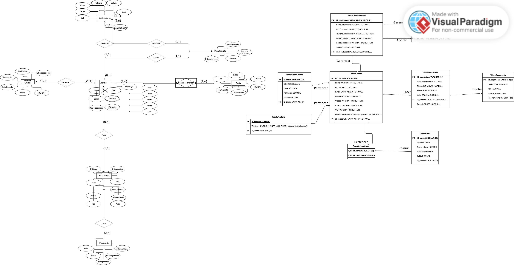

## 💼 Projeto: FlexEmpresta

A **FlexEmpresta** é uma empresa de empréstimos que enfrenta desafios na organização de seus dados devido ao rápido crescimento de clientes. O projeto tem como objetivo estruturar e padronizar essas informações, eliminando duplicidades e facilitando o acesso e a tomada de decisões.

## 🧠 Objetivo
Aplicar técnicas de **modelagem de dados** para identificar, organizar e representar as informações da empresa de forma clara e padronizada, facilitando o uso de ferramentas de apoio à decisão.

## 🛠️ Ferramentas e Conceitos Utilizados
- Visual Paradigm  
- Modelagem de Dados  
- **MER (Modelo Entidade-Relacionamento)**  
- **DER (Diagrama Entidade-Relacionamento)**  
- Padronização de informações  

## 📂 Entregas do Projeto
- Identificação dos principais dados da empresa  
- Criação do modelo conceitual (MER)  
- Elaboração do diagrama (DER)  
- Representação visual dos relacionamentos entre entidades  

## 🎓 Sobre o Projeto
Projeto desenvolvido para fins educacionais no curso de **Modelagem de Dados** da **Alura**.

## 🧩 Diagrama do Projeto

